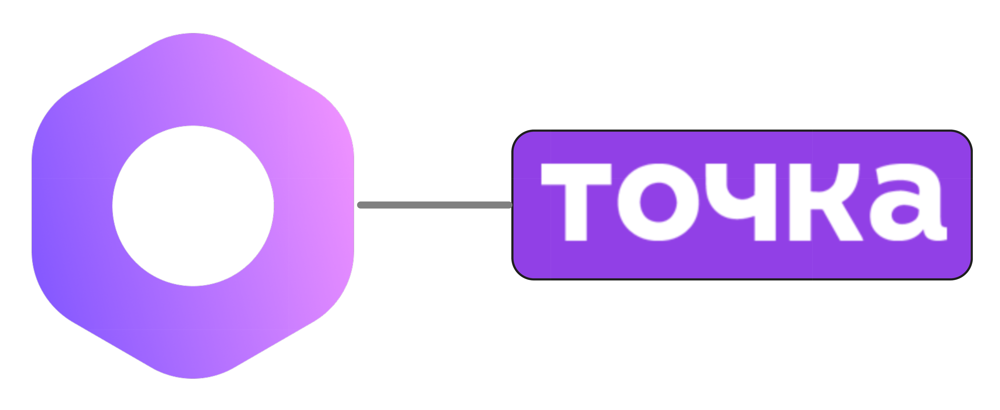

<p align="center">
  <a href="https://www.medusajs.com">
    
  </a>

</p>

<h1 align="center">
Платежи Точка Банка для Medusa
</h1>

<p align="center">
  Плагин Medusa для приёма платежей через Точка Банк.
  <br/>
  <a href="https://github.com/fatheroctober/medusa-payment-tochka/blob/HEAD/packages/medusa-payment-tochka/README.md">Read README in English ↗</a>
</p>

<br/>

<p align="center">
  <a href="https://medusajs.com">
    
  </a>
  <a href="https://medusajs.com">
    
  </a>
</p>

## Возможности

- 🔗 **Бесшовная интеграция** с платёжной системой Точка Банк
- 🧾 **Формирование онлайн-чеков** в соответствии с 54-ФЗ (российские фискальные требования)
- 1️⃣ **Одностадийные** (автосписание) и 2️⃣ **двухстадийные** (авторизация/холдирование) сценарии оплаты
- 🔄 **Полные** и **частичные возвраты**
- 🔔 **Вебхук-уведомления** о статусах платежей в реальном времени
- 🛡 **JWT-верификация вебхуков** с использованием JWK публичных ключей для повышенной безопасности
- 💳 **Множественные способы оплаты** - банковские карты, СБП (Система Быстрых Платежей) и другие
- 🔍 **Подробное логирование** для отладки и мониторинга
- 🏦 **Эквайринговые операции** - полная интеграция с платформой интернет-эквайринга Точка Банк

## Требования

- Medusa v2.7.0 или выше
- Node.js v20 или выше
- Аккаунт Точка Банк с подключенным интернет-эквайрингом
- JWT токен и client ID от Точка Банк
- Публичный ключ webhook от Точка Банк (для верификации вебхуков)

## Установка

```bash
yarn add medusa-payment-tochka
# или
npm install medusa-payment-tochka
```

## Конфигурация

Добавьте плагин в ваш `medusa-config.ts`:

```typescript
module.exports = defineConfig({
    modules: [
// ... другие модули
        {
            resolve: "@medusajs/medusa/payment",
            options:
                {
                    providers: [
                        {
                            resolve: "medusa-payment-tochka/providers/payment-tochka",
                            id: "tochka",
                            options: {
                                tochkaJwtToken: process.env.TOCHKA_JWT_TOKEN,
                                clientId: process.env.TOCHKA_CLIENT_ID,
                                webhookPublicKeyJson: process.env.TOCHKA_WEBHOOK_PUBLIC_KEY,
                                tochkaApiVersion: "v1.0", // опционально, по умолчанию "v1.0"
                                developerMode: process.env.NODE_ENV !== "production", // опционально, по умолчанию false
                                preAuthorization: false, // опционально, включить двухстадийные платежи
                                paymentPurpose: "Оплата заказа", // опционально, описание платежа по умолчанию
                                withReceipt: true, // опционально, включить формирование чеков
                                taxSystemCode: "usn_income", // обязательно если withReceipt = true
                                taxItemDefault: "vat0", // обязательно если withReceipt = true
                                taxShippingDefault: "vat0", // обязательно если withReceipt = true
                            },
                        }
                    ]
                }
        }
    ]
})

```

## Переменные окружения

Создайте файл `.env` со следующими переменными:

```bash
# Обязательные
TOCHKA_JWT_TOKEN=ваш_jwt_токен_от_точка_банк
TOCHKA_CLIENT_ID=ваш_client_id_от_точка_банк
TOCHKA_WEBHOOK_PUBLIC_KEY='{"kty":"RSA","e":"AQAB","n":"значение_n_вашего_публичного_ключа"}'

# Опциональные
TOCHKA_API_VERSION=v1.0
TOCHKA_DEVELOPER_MODE=false
```

## Поддержка API

Этот плагин обеспечивает комплексную поддержку API эквайринга Точка Банк:

### Платёжные операции
- **Создание платёжной операции** - Генерация ссылок для оплаты
- **Получение статуса платежа** - Проверка статуса платёжной операции
- **Подтверждение платежа** - Завершение двухстадийных платежей
- **Возврат платежа** - Обработка полных или частичных возвратов
- **Платежи с чеками** - Формирование фискальных чеков в соответствии с российским 54-ФЗ

### Поддержка вебхуков
- **JWT-верификация** - Безопасная валидация вебхуков с использованием JWK публичных ключей
- **Обновления в реальном времени** - Мгновенные уведомления о статусе платежей
- **Маппинг статусов** - Автоматическое преобразование в статусы платежей Medusa

### Поддерживаемые способы оплаты
- **Банковские карты** (Visa, Mastercard, Мир)
- **СБП** (Система Быстрых Платежей)
- **Рассрочка** (Долями, Тинькофф)

## Тестирование

```bash
# Запуск тестов
npm test

# Запуск тестов в режиме наблюдения
npm run test:watch
```

## Разработка

```bash
# Запуск в режиме разработки
npm run dev

# Сборка плагина
npm run build
```

## Лицензия

Распространяется на условиях [лицензии MIT](LICENSE).

## Поддержка

Если у вас возникли проблемы или вопросы по этому плагину, пожалуйста:

1. Проверьте [GitHub Issues](https://github.com/fatheroctober/medusa-payment-tochka/issues)
2. Создайте новую проблему, если ваша ещё не зарегистрирована
3. Предоставьте подробную информацию о вашей настройке и проблеме, с которой вы столкнулись

## Участие в разработке

Мы приветствуем участие в разработке! Пожалуйста, не стесняйтесь отправлять Pull Request.